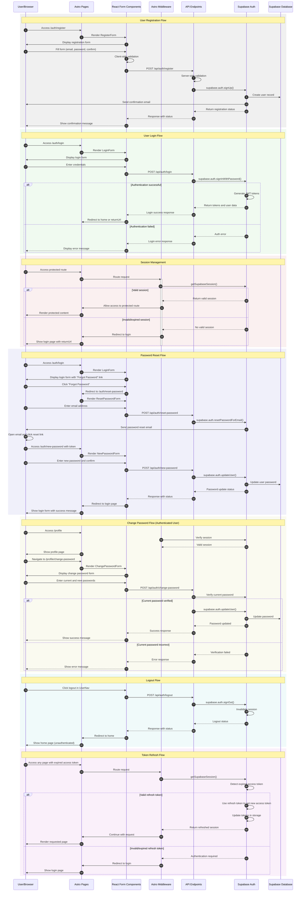

```mermaid
sequenceDiagram
    autonumber
    
    %% Participants definition
    participant User as User/Browser
    participant AstroPages as Astro Pages
    participant ReactForms as React Form Components
    participant AstroMiddleware as Astro Middleware
    participant APIEndpoints as API Endpoints
    participant SupabaseAuth as Supabase Auth
    participant Database as Supabase Database
    
    %% Style settings
    rect rgb(240, 240, 240)
        Note over User,Database: User Registration Flow
        
        %% Registration Flow
        User->>AstroPages: Access /auth/register
        AstroPages->>ReactForms: Render RegisterForm
        ReactForms->>User: Display registration form
        User->>ReactForms: Fill form (email, password, confirm)
        ReactForms->>ReactForms: Client-side validation
        ReactForms->>APIEndpoints: POST /api/auth/register
        APIEndpoints->>APIEndpoints: Server-side validation
        APIEndpoints->>SupabaseAuth: supabase.auth.signUp()
        SupabaseAuth->>Database: Create user record
        SupabaseAuth->>User: Send confirmation email
        SupabaseAuth-->>APIEndpoints: Return registration status
        APIEndpoints-->>ReactForms: Response with status
        ReactForms-->>User: Show confirmation message
    end
    
    rect rgb(240, 250, 240)
        Note over User,Database: User Login Flow
        
        %% Login Flow
        User->>AstroPages: Access /auth/login
        AstroPages->>ReactForms: Render LoginForm
        ReactForms->>User: Display login form
        User->>ReactForms: Enter credentials
        ReactForms->>APIEndpoints: POST /api/auth/login
        APIEndpoints->>SupabaseAuth: supabase.auth.signInWithPassword()
        
        alt Authentication successful
            SupabaseAuth->>SupabaseAuth: Generate JWT tokens
            SupabaseAuth-->>APIEndpoints: Return tokens and user data
            APIEndpoints-->>ReactForms: Login success response
            ReactForms->>AstroPages: Redirect to home or returnUrl
        else Authentication failed
            SupabaseAuth-->>APIEndpoints: Auth error
            APIEndpoints-->>ReactForms: Login error response
            ReactForms-->>User: Display error message
        end
    end
    
    rect rgb(250, 240, 240)
        Note over User,Database: Session Management
        
        %% Session Validation (happens on protected routes)
        User->>AstroPages: Access protected route
        AstroPages->>AstroMiddleware: Route request
        activate AstroMiddleware
        AstroMiddleware->>SupabaseAuth: getSupabaseSession()
        
        alt Valid session
            SupabaseAuth-->>AstroMiddleware: Return valid session
            AstroMiddleware->>AstroPages: Allow access to protected route
            AstroPages->>User: Render protected content
        else Invalid/expired session
            SupabaseAuth-->>AstroMiddleware: No valid session
            AstroMiddleware->>AstroPages: Redirect to login
            AstroPages->>User: Show login page with returnUrl
        end
        deactivate AstroMiddleware
    end
    
    rect rgb(240, 240, 250)
        Note over User,Database: Password Reset Flow
        
        %% Reset Password Flow
        User->>AstroPages: Access /auth/login
        AstroPages->>ReactForms: Render LoginForm
        ReactForms->>User: Display login form with "Forgot Password" link
        User->>ReactForms: Click "Forgot Password"
        ReactForms->>AstroPages: Redirect to /auth/reset-password
        AstroPages->>ReactForms: Render ResetPasswordForm
        User->>ReactForms: Enter email address
        ReactForms->>APIEndpoints: POST /api/auth/reset-password
        APIEndpoints->>SupabaseAuth: supabase.auth.resetPasswordForEmail()
        SupabaseAuth->>User: Send password reset email
        
        User->>User: Open email and click reset link
        User->>AstroPages: Access /auth/new-password with token
        AstroPages->>ReactForms: Render NewPasswordForm
        User->>ReactForms: Enter new password and confirm
        ReactForms->>APIEndpoints: POST /api/auth/new-password
        APIEndpoints->>SupabaseAuth: supabase.auth.updateUser()
        SupabaseAuth->>Database: Update user password
        SupabaseAuth-->>APIEndpoints: Password update status
        APIEndpoints-->>ReactForms: Response with status
        ReactForms->>AstroPages: Redirect to login page
        AstroPages->>User: Show login form with success message
    end
    
    rect rgb(250, 250, 240)
        Note over User,Database: Change Password Flow (Authenticated User)
        
        %% Change Password Flow
        User->>AstroPages: Access /profile
        AstroMiddleware->>SupabaseAuth: Verify session
        SupabaseAuth-->>AstroMiddleware: Valid session
        AstroPages->>User: Show profile page
        User->>AstroPages: Navigate to /profile/change-password
        AstroPages->>ReactForms: Render ChangePasswordForm
        ReactForms->>User: Display change password form
        User->>ReactForms: Enter current and new passwords
        ReactForms->>APIEndpoints: POST /api/auth/change-password
        
        APIEndpoints->>SupabaseAuth: Verify current password
        alt Current password verified
            APIEndpoints->>SupabaseAuth: supabase.auth.updateUser()
            SupabaseAuth->>Database: Update password
            SupabaseAuth-->>APIEndpoints: Password updated
            APIEndpoints-->>ReactForms: Success response
            ReactForms-->>User: Show success message
        else Current password incorrect
            SupabaseAuth-->>APIEndpoints: Verification failed
            APIEndpoints-->>ReactForms: Error response
            ReactForms-->>User: Show error message
        end
    end
    
    rect rgb(240, 250, 250)
        Note over User,Database: Logout Flow
        
        %% Logout Flow
        User->>ReactForms: Click logout in UserNav
        ReactForms->>APIEndpoints: POST /api/auth/logout
        APIEndpoints->>SupabaseAuth: supabase.auth.signOut()
        SupabaseAuth->>SupabaseAuth: Invalidate session
        SupabaseAuth-->>APIEndpoints: Logout status
        APIEndpoints-->>ReactForms: Response with status
        ReactForms->>AstroPages: Redirect to home
        AstroPages->>User: Show home page (unauthenticated)
    end
    
    rect rgb(250, 240, 250)
        Note over User,Database: Token Refresh Flow
        
        %% Token Refresh Flow (happens automatically)
        User->>AstroPages: Access any page with expired access token
        AstroPages->>AstroMiddleware: Route request
        AstroMiddleware->>SupabaseAuth: getSupabaseSession()
        SupabaseAuth->>SupabaseAuth: Detect expired access token
        
        alt Valid refresh token
            SupabaseAuth->>SupabaseAuth: Use refresh token to get new access token
            SupabaseAuth->>SupabaseAuth: Update tokens in storage
            SupabaseAuth-->>AstroMiddleware: Return refreshed session
            AstroMiddleware->>AstroPages: Continue with request
            AstroPages->>User: Render requested page
        else Invalid/expired refresh token
            SupabaseAuth-->>AstroMiddleware: Authentication required
            AstroMiddleware->>AstroPages: Redirect to login
            AstroPages->>User: Show login page
        end
    end
``` 