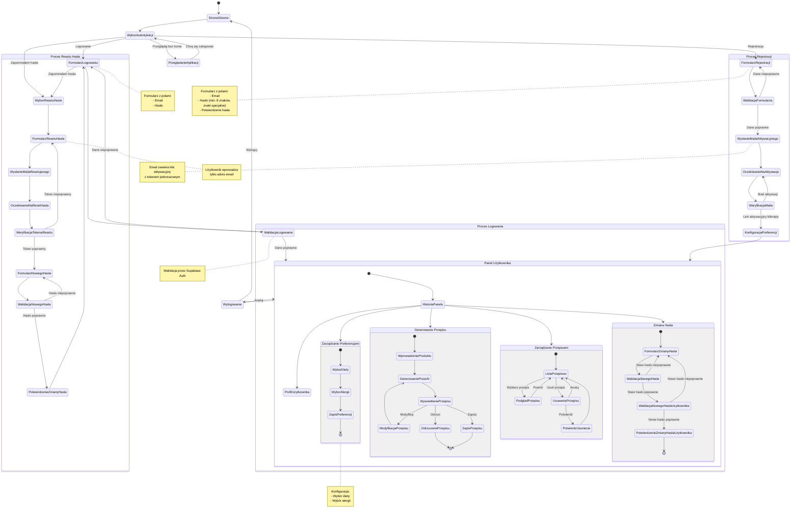

<user_journey_analysis>

# Analiza podróży użytkownika w module autentykacji

## 1. Zidentyfikowane ścieżki użytkownika

Na podstawie dokumentacji projektowej i specyfikacji autentykacji, zidentyfikowano następujące ścieżki użytkownika:

### Rejestracja

- Przejście do formularza rejestracji
- Wypełnienie formularza (email, hasło, potwierdzenie hasła)
- Walidacja danych
- Otrzymanie maila aktywacyjnego
- Aktywacja konta przez link
- Konfiguracja preferencji żywieniowych
- Przejście do panelu użytkownika

### Logowanie

- Przejście do formularza logowania
- Wprowadzenie danych logowania
- Walidacja danych
- Uzyskanie dostępu do panelu użytkownika lub otrzymanie komunikatu o błędzie

### Reset hasła

- Wybór opcji resetowania hasła z formularza logowania
- Wprowadzenie adresu email
- Otrzymanie maila z linkiem resetującym
- Ustawienie nowego hasła
- Powrót do ekranu logowania

### Zmiana hasła (dla zalogowanych użytkowników)

- Przejście do opcji zmiany hasła w panelu użytkownika
- Wprowadzenie aktualnego i nowego hasła
- Walidacja i potwierdzenie zmiany

### Zarządzanie preferencjami żywieniowymi

- Przejście do sekcji preferencji w panelu użytkownika
- Wybór diety i alergii
- Zapisanie preferencji

### Generowanie i zarządzanie przepisami

- Wprowadzenie promptu do generowania przepisu
- Modyfikacja wygenerowanego przepisu
- Zapisanie lub odrzucenie przepisu
- Przeglądanie zapisanych przepisów

### Wylogowanie

- Wybranie opcji wylogowania
- Potwierdzenie wylogowania
- Powrót do strony głównej

## 2. Główne podróże i stany

### Podróż: Rejestracja i pierwsze kroki

Stany:

- StronaGlowna
- FormularzRejestracji
- WalidacjaFormularza
- WyslanieMailaAktywacyjnego
- OczekiwanieNaAktywacje
- WeryfikacjaMaila
- KonfiguracjaPreferencji
- PanelUzytkownika

### Podróż: Logowanie i dostęp do funkcjonalności

Stany:

- StronaGlowna
- FormularzLogowania
- WalidacjaLogowania
- PanelUzytkownika
- GenerowaniePrzepisu
- ZarzadzaniePrzepisami

### Podróż: Resetowanie zapomnianego hasła

Stany:

- FormularzLogowania
- FormularzResetuHasla
- WyslanieMailaResetujacego
- OczekiwanieNaResetHasla
- WeryfikacjaTokenaResetu
- FormularzNowegoHasla
- PotwierdzenieZmianyHasla

## 3. Punkty decyzyjne i alternatywne ścieżki

### Punkty decyzyjne

- WyborAutentykacji: Logowanie, Rejestracja, Reset hasła, Przeglądanie bez konta
- WalidacjaLogowania: Dane poprawne vs. niepoprawne
- WalidacjaFormularza: Dane poprawne vs. niepoprawne
- WeryfikacjaMaila: Link aktywacyjny kliknięty vs. brak aktywacji
- WeryfikacjaTokenaResetu: Token poprawny vs. niepoprawny
- WalidacjaNowegoHasla: Hasło poprawne vs. niepoprawne
- WyswietleniePrzepisu: Modyfikacja, Zapis, Odrzucenie
- Wylogowanie: Wyloguj vs. Anuluj

### Alternatywne ścieżki

- Próba logowania → Niepoprawne dane → Ponowna próba
- Próba logowania → Zapomniałem hasła → Reset hasła
- Przeglądanie bez konta → Decyzja o rejestracji/logowaniu
- Resetowanie hasła → Niepoprawny token → Ponowna próba
- Zmiana hasła → Niepoprawne stare/nowe hasło → Ponowna próba

## 4. Cel każdego stanu

- StronaGlowna: Punkt wejścia do aplikacji, prezentacja głównych funkcjonalności.
- FormularzLogowania: Umożliwienie użytkownikowi logowania do systemu.
- FormularzRejestracji: Zbieranie danych nowego użytkownika do utworzenia konta.
- WyslanieMailaAktywacyjnego: Inicjacja procesu weryfikacji adresu email.
- KonfiguracjaPreferencji: Zebranie informacji o preferencjach żywieniowych użytkownika.
- PanelUzytkownika: Centralny punkt dostępu do wszystkich funkcjonalności użytkownika.
- GenerowaniePrzepisu: Umożliwienie użytkownikowi wygenerowania przepisu kulinarnego.
- ZarzadzaniePrzepisami: Zarządzanie zapisanymi przepisami (podgląd, usuwanie).
- FormularzResetuHasla: Inicjacja procesu odzyskiwania hasła.
- FormularzNowegoHasla: Ustawienie nowego hasła po resecie.
- ZarzadzaniePreferencjami: Modyfikacja wcześniej ustawionych preferencji żywieniowych.
- WprowadzenieProduktu: Wprowadzenie danych wejściowych dla generatora przepisów.
- GenerowaniePrzezAI: Przetwarzanie promptu i generowanie przepisu przez AI.
- WyswietleniePrzepisu: Prezentacja wygenerowanego przepisu z opcjami dalszych działań.
</user_journey_analysis>

<mermaid_diagram>

