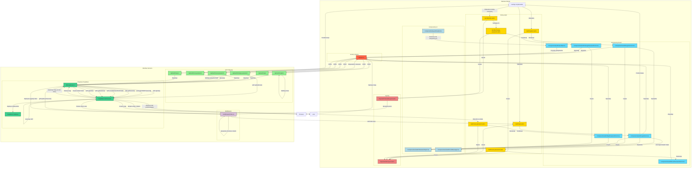

```mermaid
flowchart TD
    %% Authentication Flow Diagram for Healthy Meal App

    %% Main components and their groupings
    subgraph "Warstwa Klienta"
        UI[Interfejs Użytkownika]

        subgraph "Strony Astro"
            Login["/auth/login.astro"]
            Register["/auth/register.astro"]
            ResetPwd["/auth/reset-password.astro"]
            NewPwd["/auth/new-password.astro"]
            Profile["/profile/index.astro"]
            ChangePwd["/profile/change-password.astro"]
        end

        subgraph "Komponenty React"
            LoginForm["/components/auth/LoginForm.tsx"]
            RegisterForm["/components/auth/RegisterForm.tsx"]
            ResetPwdForm["/components/auth/ResetPasswordForm.tsx"]
            NewPwdForm["/components/auth/NewPasswordForm.tsx"]
            ChangePwdForm["/components/auth/ChangePasswordForm.tsx"]
            UserNav["/components/auth/UserNav.tsx"]
        end

        subgraph "Serwisy Klienta"
            AuthService["/lib/auth.ts"]
        end

        subgraph "Komponenty UI"
            PasswordInput["/components/ui/auth/PasswordInput.tsx"]
            FormMessage["/components/ui/auth/FormMessage.tsx"]
            HeaderAuth["/components/layout/Header.tsx"]
        end

        subgraph "Layouty"
            AuthLayout["/layouts/AuthLayout.astro"]
            ProtectedLayout["/layouts/ProtectedLayout.astro"]
        end
    end

    subgraph "Warstwa Serwera"
        subgraph "Middleware"
            AstroMiddleware["/middleware/index.ts"]
        end

        subgraph "API Endpoints"
            RegisterAPI["/api/auth/register"]
            LoginAPI["/api/auth/login"]
            ResetPwdAPI["/api/auth/reset-password"]
            NewPwdAPI["/api/auth/new-password"]
            ChangePwdAPI["/api/auth/change-password"]
            LogoutAPI["/api/auth/logout"]
        end

        subgraph "Integracja Supabase"
            SupabaseClient["/db/supabase.ts"]
            SupabaseAuth["Supabase Auth Service"]
            SupabaseDB["Supabase Database"]
        end
    end

    %% Przepływy autentykacji i połączenia między komponentami

    %% Przepływ rejestracji
    UI -->|Odwiedza| Register
    Register -->|Używa| AuthLayout
    Register -->|Renderuje| RegisterForm
    RegisterForm -->|Używa| PasswordInput
    RegisterForm -->|Wyświetla| FormMessage
    RegisterForm -->|Wywołuje| AuthService
    AuthService -->|POST| RegisterAPI
    RegisterAPI -->|Waliduje dane| RegisterAPI
    RegisterAPI -->|Wywołuje| SupabaseClient
    SupabaseClient -->|"auth.signUp()"| SupabaseAuth
    SupabaseAuth -->|Zapisuje użytkownika| SupabaseDB
    SupabaseAuth -->|Wysyła email potwierdzający| User

    %% Przepływ logowania
    UI -->|Odwiedza| Login
    Login -->|Używa| AuthLayout
    Login -->|Renderuje| LoginForm
    LoginForm -->|Używa| PasswordInput
    LoginForm -->|Wyświetla| FormMessage
    LoginForm -->|Wywołuje| AuthService
    AuthService -->|POST| LoginAPI
    LoginAPI -->|Wywołuje| SupabaseClient
    SupabaseClient -->|"auth.signInWithPassword()"| SupabaseAuth
    SupabaseAuth -->|Generuje JWT| SupabaseAuth
    SupabaseAuth -->|Zwraca sesję| SupabaseClient
    LoginAPI -->|Odpowiedź z tokenami| AuthService
    AuthService -->|Zapisuje sesję| Browser
    LoginForm -->|Przekierowuje| UI

    %% Zarządzanie sesją i middleware
    AstroMiddleware -->|Wywoływane dla wszystkich żądań| AstroMiddleware
    AstroMiddleware -->|"getSupabaseSession()"| SupabaseClient
    SupabaseClient -->|"auth.getSession()"| SupabaseAuth
    SupabaseAuth -->|Zwraca status sesji| AstroMiddleware
    AstroMiddleware -->|Sprawdza chronione ścieżki| AstroMiddleware
    AstroMiddleware -->|Jeśli brak sesji| Login

    %% Dostęp do chronionych zasobów
    UI -->|Odwiedza ścieżkę chronioną| Profile
    Profile -->|Używa| ProtectedLayout
    ProtectedLayout -->|Sprawdza przez| AstroMiddleware

    %% Resetowanie hasła
    LoginForm -->|Link Zapomniałem hasła| ResetPwd
    ResetPwd -->|Używa| AuthLayout
    ResetPwd -->|Renderuje| ResetPwdForm
    ResetPwdForm -->|Wywołuje| AuthService
    AuthService -->|POST| ResetPwdAPI
    ResetPwdAPI -->|Wywołuje| SupabaseClient
    SupabaseClient -->|"auth.resetPasswordForEmail()"| SupabaseAuth
    SupabaseAuth -->|Wysyła email z linkiem| User

    User -->|Klika link w emailu| NewPwd
    NewPwd -->|Używa| AuthLayout
    NewPwd -->|Renderuje| NewPwdForm
    NewPwdForm -->|Używa| PasswordInput
    NewPwdForm -->|Wywołuje| AuthService
    AuthService -->|POST| NewPwdAPI
    NewPwdAPI -->|Wywołuje| SupabaseClient
    SupabaseClient -->|"auth.updateUser()"| SupabaseAuth

    %% Zmiana hasła
    Profile -->|Nawiguje do| ChangePwd
    ChangePwd -->|Używa| ProtectedLayout
    ChangePwd -->|Renderuje| ChangePwdForm
    ChangePwdForm -->|Używa| PasswordInput
    ChangePwdForm -->|Wywołuje| AuthService
    AuthService -->|POST| ChangePwdAPI
    ChangePwdAPI -->|Waliduje aktualne hasło| SupabaseClient
    ChangePwdAPI -->|"auth.updateUser()"| SupabaseAuth

    %% Wylogowanie
    HeaderAuth -->|Renderuje dla zalogowanych| UserNav
    UserNav -->|Przycisk wylogowania| AuthService
    AuthService -->|POST| LogoutAPI
    LogoutAPI -->|Wywołuje| SupabaseClient
    SupabaseClient -->|"auth.signOut()"| SupabaseAuth
    SupabaseAuth -->|Usuwa sesję| Browser
    LogoutAPI -->|Przekierowuje| UI

    %% Automatyczne odświeżanie tokena
    AstroMiddleware -->|Wykrywa wygasły token| SupabaseClient
    SupabaseClient -->|Używa refresh token| SupabaseAuth
    SupabaseAuth -->|Generuje nowy access token| SupabaseClient

    %% Stylizacja diagramu
    classDef astroPage fill:#FFD700,stroke:#333,stroke-width:1px;
    classDef reactComponent fill:#61DAFB,stroke:#333,stroke-width:1px;
    classDef apiEndpoint fill:#90EE90,stroke:#333,stroke-width:1px;
    classDef serviceComponent fill:#FF6347,stroke:#333,stroke-width:1px;
    classDef middleware fill:#D8BFD8,stroke:#333,stroke-width:1px;
    classDef supabase fill:#3ECF8E,stroke:#333,stroke-width:1px;
    classDef layout fill:#F08080,stroke:#333,stroke-width:1px;
    classDef sharedComponent fill:#ADD8E6,stroke:#333,stroke-width:1px;

    %% Zastosowanie styli
    class Login,Register,ResetPwd,NewPwd,Profile,ChangePwd astroPage;
    class LoginForm,RegisterForm,ResetPwdForm,NewPwdForm,ChangePwdForm,UserNav reactComponent;
    class RegisterAPI,LoginAPI,ResetPwdAPI,NewPwdAPI,ChangePwdAPI,LogoutAPI apiEndpoint;
    class AuthService serviceComponent;
    class AstroMiddleware middleware;
    class SupabaseAuth,SupabaseClient,SupabaseDB supabase;
    class AuthLayout,ProtectedLayout layout;
    class PasswordInput,FormMessage,HeaderAuth sharedComponent;
```
